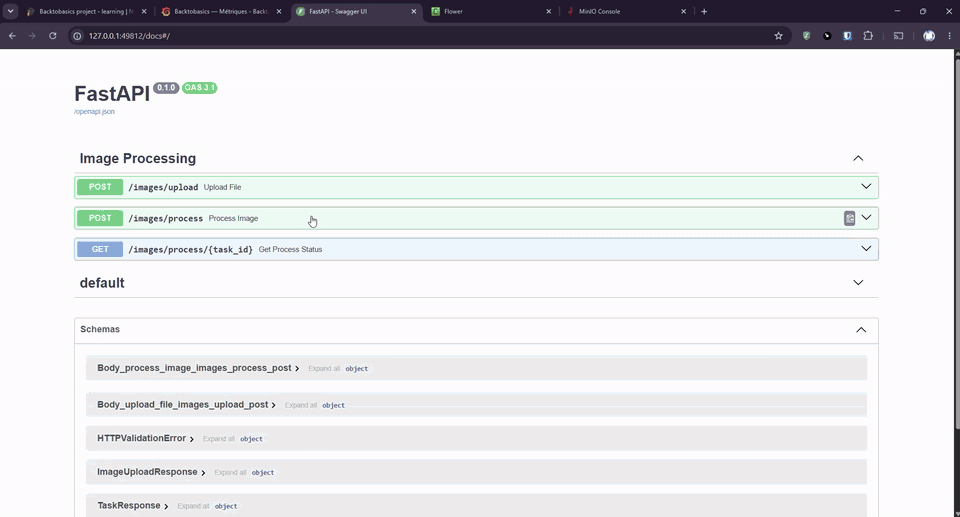
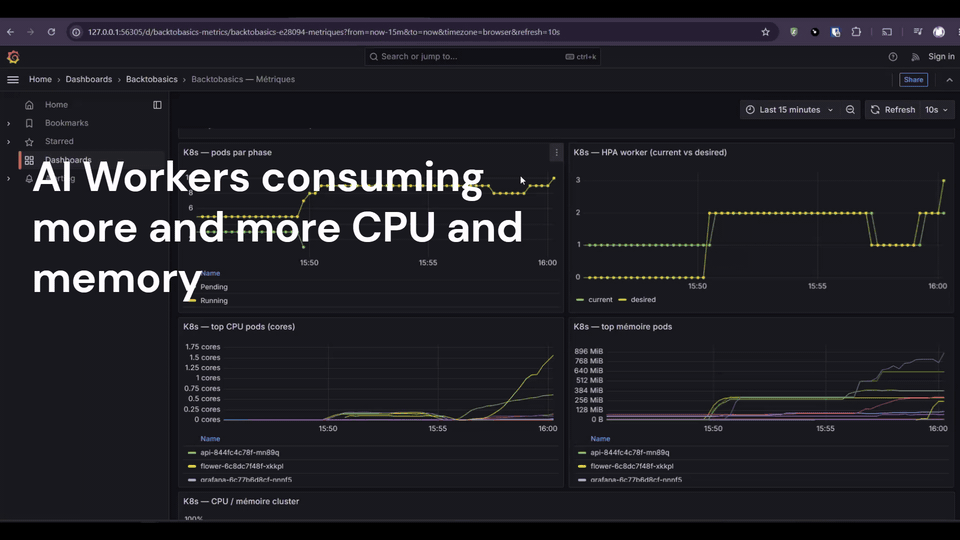
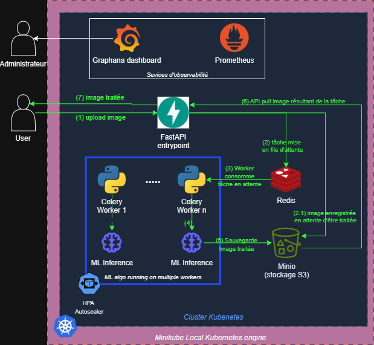

# BacktobasicsPython


**Background removal as a service** — cloud-native design, deployed locally on Kubernetes (Minikube).

Upload an image → async Celery task → PyTorch inference (DeepLabV3 ResNet50) → RGBA PNG returned → artifacts stored in S3-compatible MinIO.

Deep dive for contributors: [PROJECT_CONTEXT.md](PROJECT_CONTEXT.md) · Project page: [personalwebsite-aap.pages.dev/projects/backtobasics](https://personalwebsite-aap.pages.dev/projects/backtobasics)

---

## Demo videos

### 1 — End-to-end pipeline

Swagger upload → Celery worker processes the image → input and output objects appear in the MinIO bucket.



### 2 — Load test and horizontal scaling

Locust ramps up requests per second. The worker HPA scales from **1 → 3** pods. Grafana tracks latency, task duration, inference time, and cluster resources.



---

## Architecture



Editable source: [BackToBasicsInfra.drawio](BackToBasicsInfra.drawio)

**Workflow**

1. Client uploads an image via FastAPI (`POST /images/process`).
2. API stores the file in MinIO and enqueues a Celery task on Redis.
3. A worker runs DeepLabV3 (CPU) and writes the RGBA result back to MinIO.
4. Client polls `GET /images/process/{task_id}` until completion.
5. Prometheus scrapes API and worker `/metrics` plus Kubernetes metrics; Grafana visualizes the stack.

---

## What I engineered

- **Clean architecture** (ports & adapters) — decoupled, testable ML logic
- **Async pipeline** — FastAPI + Celery + Redis
- **Object storage** — MinIO (S3-compatible, boto3)
- **Observability** — Prometheus + Grafana (API latency, Celery p99, inference time, K8s resources)
- **Kubernetes** — Minikube manifests, Horizontal Pod Autoscaler on workers

---

## Key challenge

Inference is **CPU-bound and slow**. Without scaling, tasks accumulate and latency explodes.

**Solution:** horizontal scaling of Celery workers via HPA — more requests → more worker pods → stable throughput under load. See [k8s/worker/03-hpa.yaml](k8s/worker/03-hpa.yaml).

---

## Quick start (Kubernetes / Minikube)

**Prerequisites:** Docker, Minikube, kubectl, Poetry.

1. **MinIO secret** (required once per clone):

   ```powershell
   Copy-Item k8s\secrets\minio.yaml.example k8s\secrets\minio.yaml
   ```

2. **Start the full stack** (build, deploy, open UI tunnels):

   ```powershell
   .\k8s\start-stack.ps1
   ```

   Keep the tunnel terminals open. On **Windows + Docker driver**, use the `http://127.0.0.1:xxxxx` URLs from `minikube service --url` — NodePorts are usually not reachable from the host browser.

3. **Try the API** — open the Swagger tunnel URL (`/docs`), upload an image, poll the task until `SUCCESS`, then check MinIO console for input/output objects.

4. **Load test** (optional) — download sample images, then run Locust against the API tunnel URL (**without** `/docs`):

   ```powershell
   .\project\tests\load\fetch_sample_images.ps1
   poetry run locust -f project/tests/load/locustfile.py --host http://127.0.0.1:<api_tunnel_port>
   ```

   Suggested Locust settings for the HPA demo: 50–60 users, spawn rate 6–8/s, run 2–3 minutes.

5. **Watch scaling:**

   ```powershell
   minikube kubectl -- get hpa -n backtobasics -w
   ```

   Grafana dashboard **Backtobasics — Métriques** (9 panels): HTTP latency, Celery p99, ML inference, mask confidence, pods by phase, HPA worker, top CPU/memory, cluster %.

Details: [k8s/README.md](k8s/README.md)

---

## Quick start (Docker Compose)

For local development without Kubernetes:

```bash
cp .env.example .env   # or copy manually on Windows
docker compose up --build
```

| Interface | URL |
|-----------|-----|
| API / Swagger | http://localhost:5000 · http://localhost:5000/docs |
| API metrics | http://localhost:5000/metrics |
| Worker metrics | http://localhost:8000/metrics |
| Flower | http://localhost:5555 |
| MinIO API / console | http://localhost:9000 · http://localhost:9001 |
| Prometheus | http://localhost:9090 |
| Grafana | http://localhost:3000 |

Locust (host machine):

```bash
.\project\tests\load\fetch_sample_images.ps1
poetry run locust -f project/tests/load/locustfile.py --host http://localhost:5000
```

---

## Monitoring

Prometheus scrapes FastAPI (`/metrics`), Celery worker metrics (port 8000), kube-state-metrics, and cAdvisor. Grafana dashboard: `monitoring/grafana/dashboards/backtobasics.json` (provisioned in Docker Compose and K8s).

**Demo panels (9):** HTTP latency · Celery task duration p99 · ML inference time · mask confidence · K8s pods by phase · HPA desired replicas · top CPU pods · top memory pods · cluster CPU/memory %.

---

## Scaling philosophy

Size the **cluster budget** first (Minikube CPUs/RAM), then each **worker pod** so one ML task runs reliably. Increase **throughput** by adding worker replicas (HPA), within node limits.

| Lever | Current value | File |
|-------|---------------|------|
| Minikube node | 4 CPU / 7168 Mi | `k8s/start-stack.ps1` |
| Worker pod | `concurrency=1`, request `500m`/`1Gi`, limit `2Gi` | `k8s/worker/01-deployment.yaml` |
| HPA worker | `min=1`, `max=3`, CPU target `75%`, scale-up +1 pod/min after 60s | `k8s/worker/03-hpa.yaml` |
| API | 1 replica, request `100m`/`256Mi` | `k8s/api/01-deployment.yaml` |

| Goal | Action | Scale type |
|------|--------|------------|
| More parallel images | Raise `maxReplicas` / `minReplicas` (HPA) | Horizontal |
| Heavier ML task (model, resolution, RAM) | Worker `resources` | Vertical (pod) |
| Cluster ceiling too low | Minikube `--cpus` / `--memory` | Vertical (node) |
| HPA reacts too late / too early | `averageUtilization` | HPA tuning |

Under load, watch HPA `current/desired`, worker CPU in Grafana, and cluster % panels.

---

## Development

```bash
poetry install --with dev
# tests
PYTHONPATH=project poetry run pytest project/tests/ -v
# lint
poetry run ruff check project/src project/tests
```

---

## Credits

Kubernetes and DevOps learning: [TechWorld With Nana](https://www.youtube.com/@TechWorldwithNana).

---

## License

[MIT](LICENSE)
